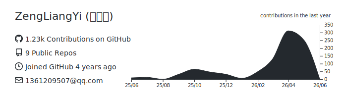
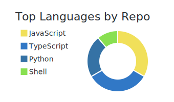

<!-- ====== HEADER ====== -->

**Frontend Engineer with full-stack delivery experience, building Web Apps, AI Products, and Knowledge Tools.**

React / Vue / Flutter / Next.js · AI Workflow · Knowledge Management

记录工程实践，也持续探索 AI 如何改变个人与团队的工作流。

---

<!-- ====== TECH STACK ====== -->

<h3> Tech Stack / 技术栈</h3>

**Web & App Products / Web 与应用产品**

**Backend & Automation / 后端与自动化**

**Delivery / 交付部署**

---

<!-- ====== GITHUB STATS ====== -->

<h3> GitHub Stats / 数据概览</h3>

&nbsp;&nbsp;

---

<!-- ====== BLOG POSTS ====== -->

<h3> Latest Blog Posts / 最新文章</h3>

<!-- BLOG-POST-LIST:START -->
- [AI 编程 5000 条对话后的复盘与反思](https://blog.csdn.net/2201_75708499/article/details/162089004) — Thu Jun 18 2026 1:59 AM
- [我用知识图谱发现了一个重构的隐藏依赖](https://blog.csdn.net/2201_75708499/article/details/161899813) — Fri Jun 12 2026 1:00 AM
- [用 ChatCrystal 管理团队知识：多人协作方案](https://blog.csdn.net/2201_75708499/article/details/161899777) — Fri Jun 12 2026 12:45 AM
- [从 ChatCrystal 导出到 Obsidian 的工作流](https://blog.csdn.net/2201_75708499/article/details/161867866) — Thu Jun 11 2026 1:00 AM
- [CLI 自动化：构建知识管理流水线](https://blog.csdn.net/2201_75708499/article/details/161867829) — Thu Jun 11 2026 12:45 AM<!-- BLOG-POST-LIST:END -->

---

<!-- ====== FOOTER ====== -->

<picture>
  <source media="(prefers-color-scheme: dark)" srcset="https://raw.githubusercontent.com/ZengLiangYi/ZengLiangYi/output/github-snake-dark.svg" />
  <source media="(prefers-color-scheme: light)" srcset="https://raw.githubusercontent.com/ZengLiangYi/ZengLiangYi/output/github-snake.svg" />
  
</picture>

  

<h3 id="wechat-qrcode"> WeChat / 微信</h3>

 

**WeChat:** Yizel1

  

