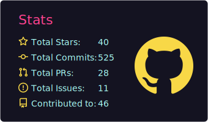
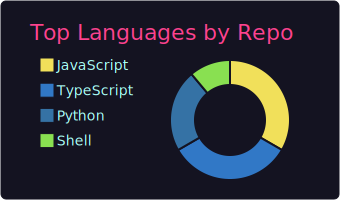
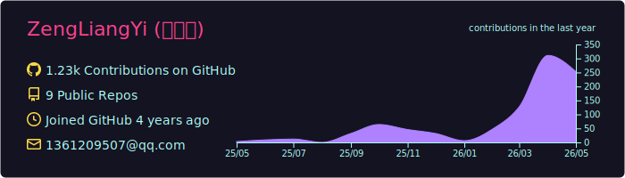

<!-- HEADER -->

 

### 🏗️ 勤能补拙

> *In the middle of difficulty lies opportunity.*

🔗 [zengliangyi.cn](https://www.zengliangyi.cn)

---

<!-- ABOUT -->

**Full-stack developer** focused on building enterprise-grade web applications and AI-powered products.

Passionate about **React / Vue ecosystem**, **cross-platform mobile development**, and **AI integration**.

---

<!-- TECH STACK -->

#### `// Languages`

#### `// Frameworks & Libraries`

#### `// Build & DevTools`

#### `// State & Data`

#### `// AI & Cloud`

---

<!-- GITHUB STATS (自托管，由 GitHub Actions 生成) -->

&nbsp;&nbsp;

  

  

---

<!-- SNAKE CONTRIBUTION -->

<picture>
  <source media="(prefers-color-scheme: dark)" srcset="https://raw.githubusercontent.com/ZengLiangYi/ZengLiangYi/output/github-snake-dark.svg" />
  <source media="(prefers-color-scheme: light)" srcset="https://raw.githubusercontent.com/ZengLiangYi/ZengLiangYi/output/github-snake.svg" />
  
</picture>

---

<!-- BLOG POSTS -->

### 📕 Latest Blog Posts

<!-- BLOG-POST-LIST:START -->
<!-- BLOG-POST-LIST:END -->

---

